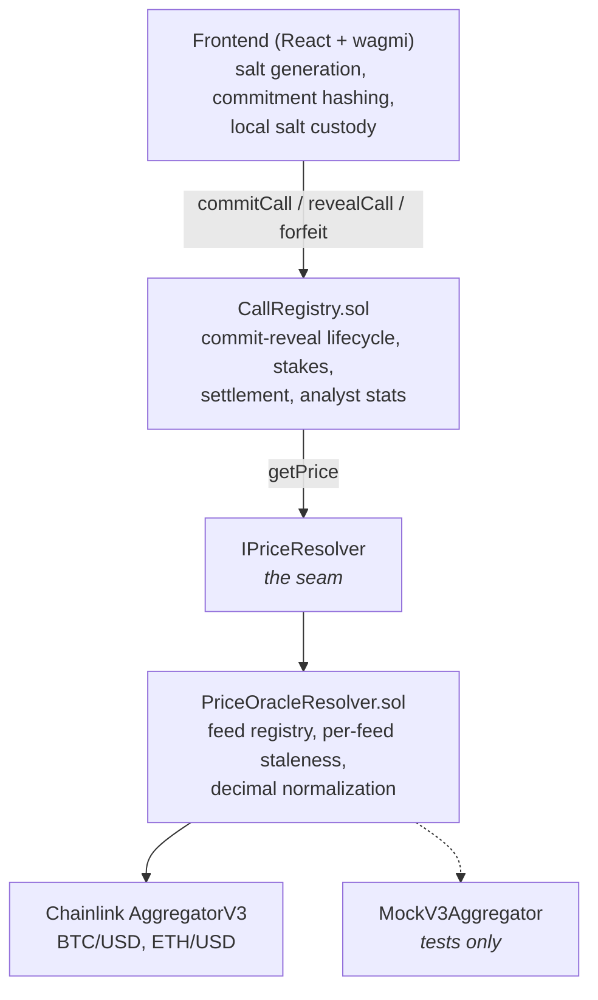
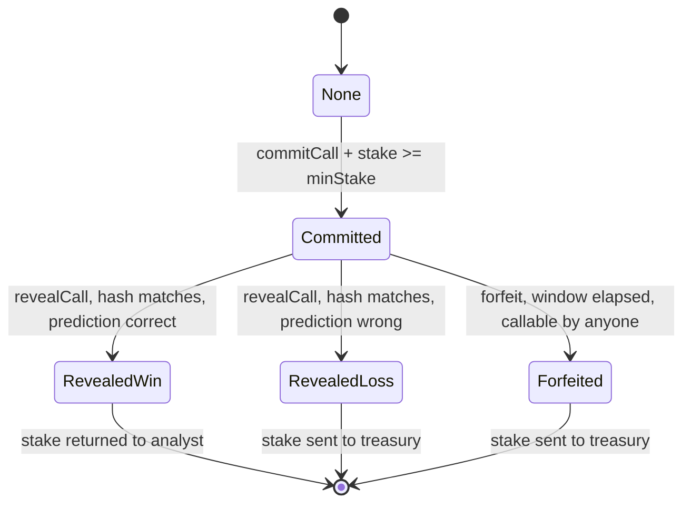

# Architecture

Working document. Sections are filled in as the phase that builds them closes;
anything marked _planned_ is specification, not implemented code.

## Layers



The registry depends on `IPriceResolver`, never on Chainlink. Everything
Chainlink-specific — the interface import, `latestRoundData()`, decimals,
staleness — lives in the adapter. Rationale and the rejected alternative are in
[[ADR-008-oracle-adapter-layer]].

`MockV3Aggregator` deliberately implements the _Chainlink_ interface, not
`IPriceResolver`. Mocking one level lower means tests exercise the adapter's real
normalization and staleness code instead of stubbing it out — which is the code
most worth testing.

## Call lifecycle



Both terminal transitions out of `Committed` are one-way. There is no path from
`Forfeited` back to a revealed state — invariant 5 — and the reveal window is
snapshotted per call at commit time so that an admin lowering `revealWindow`
cannot retroactively push open calls past their deadline
([[ADR-009-initial-protocol-parameters]]).

## Timeline of a single call

```
  commit                        deadline                    window closes
    |                               |                              |
    |<------ minHorizon .. -------->|<------ revealWindow -------->|
    |         .. maxHorizon         |          (48h)               |
    |                               |                              |
  stake locked            reveal becomes legal            forfeit becomes legal
  params hidden           price is read here              stake goes to treasury
```

Revealing before the deadline always reverts — invariant 2. If that check fails,
the analyst could wait for the price to move and reveal only when it favours
them, and the whole scheme is decorative.

Two arrows point at the deadline, and they are not the same arrow. **The reveal
happens anywhere in the 48-hour window; the price is read at the deadline
itself.** Settlement calls `getPriceAt(assetId, deadline, roundId)` and not
`getPrice(assetId)`, so moving the reveal later inside the window changes
nothing about the outcome — which is the only reason a window that wide is safe
([[ADR-010-settlement-reads-the-round-covering-the-deadline]]).

The round id is supplied by the caller because Chainlink exposes no
timestamp-to-round index. It is a lookup key, not a claim: the resolver requires
the round to exist, to predate the deadline, to sit inside that feed's staleness
window relative to the deadline, and to have **no successor that also predates
it**. Exactly one round satisfies all four for a given deadline, so there is
nothing to cherry-pick. The frontend finds it by binary search over
`getRoundData` before building the transaction.

## Commitment construction

```
commitment = keccak256(abi.encode(
    assetId,      // bytes32   keccak256("BTC/USD")
    direction,    // Direction Above | Below
    targetPrice,  // int256    8 decimals
    deadline,     // uint64    unix seconds
    salt,         // bytes32   256 bits from a CSPRNG
    analyst       // address   msg.sender at commit time
))
```

Two of these six fields are load-bearing beyond the obvious.

**`salt`** defends against brute force. The other five fields have a small, very
guessable joint domain; without the salt an attacker hashes every plausible
prediction and reads the call before it is revealed. See attack B in the README.

**`analyst`** binds the commitment to one address. A commitment is public from
the moment it is submitted, so without this field an attacker who observes a
reveal in the mempool could take the plaintext parameters, submit them against a
commitment they had copied earlier, and claim someone else's call. Including the
address makes any commitment only openable by the account that created it, and
the copied hash unrevealable by anyone.

`abi.encode` is used rather than `abi.encodePacked`: packed encoding of
variable-length or adjacent same-type fields admits collisions between distinct
tuples. The gas saved is not worth introducing a class of ambiguity into the one
value the entire protocol depends on.

## Storage layout — `Call`

| slot | packed contents                                                                 | bytes used |
| ---- | ------------------------------------------------------------------------------- | ---------- |
| 0    | `address analyst` + `uint64 deadline` + `uint24 revealWindow` + `Status status` | 32 / 32    |
| 1    | `bytes32 commitment`                                                            | 32         |
| 2    | `uint256 stake`                                                                 | 32         |

Three slots, the first one exactly full.

`revealWindow` is stored **per call**, copied from the protocol parameter at
commit time. Reading the global value live at reveal time would let an admin who
shortened it retroactively close the window on calls that were already open, and
force forfeits on analysts who had done nothing wrong. `uint24` caps a window at
roughly 194 days — far past any value worth setting — and is what makes the
snapshot fit in the slot instead of costing a fourth one.

`committedAt` is _not_ stored: no on-chain path reads it, and a cold `SSTORE` to
a fourth slot would cost every analyst 20,000 gas to serve readers who are
reading event logs anyway ([[ADR-006-drop-committedat-from-struct]]). The same
argument is why the sum of open stakes is not tracked in storage either — it is
derivable from the calls themselves, and invariant 6 is asserted by summing them.

## Reveal payload

```solidity
struct RevealParams {
  bytes32 assetId; // keccak256("BTC/USD")
  Direction direction; // Above | Below
  int256 targetPrice; // 8 decimals
  bytes32 salt; // the 256 bits from the commit
  uint80 roundId; // settlement round, found off-chain
}

function revealCall(uint256 callId, RevealParams calldata params) external;
```

Four of the six preimage fields, plus the round id. `deadline` and `analyst` are
**not** parameters — they are read from storage, where they were fixed at commit
time, so there is no way for the caller's copy to disagree with what was
committed. `roundId` is not in the preimage at all: it is not a prediction, and
it is not knowable when the commitment is made.

Grouping them in one `calldata` struct is also what keeps `revealCall` inside
the EVM's sixteen stack slots. The default build profile leaves the optimizer
off so coverage line maps and stack traces stay accurate, which means stack
depth is a real constraint rather than something `viaIR` hides.

## Trust boundaries

| Actor                | Can do                                                             | Cannot do                                                                                    |
| -------------------- | ------------------------------------------------------------------ | -------------------------------------------------------------------------------------------- |
| Analyst              | Commit, reveal their own calls                                     | Reveal early, alter a revealed call, reveal another analyst's call, avoid the forfeit record |
| Anyone               | Call `forfeit` on an expired call                                  | Move funds anywhere except the treasury                                                      |
| `DEFAULT_ADMIN_ROLE` | Swap the resolver, set treasury, set parameters, pause new commits | Touch an open call's stake, block a reveal, block a forfeit                                  |
| Chainlink            | Supply prices                                                      | Return a stale or non-positive price without the adapter reverting                           |

The admin row is the weakest one and is stated as such in the README: swapping in
a hostile resolver would control every future settlement. No timelock in the MVP.

Pausing is limited to `commitCall` on purpose — a pause that could reach
`revealCall` would let an admin run out the reveal window and strand user funds
([[ADR-003-pause-blocks-commit-only]]).

## Off-chain surface

Built in F5, under `frontend/`. Three things happen there that cannot happen
on-chain, and each one is a place where a mistake costs a stake rather than
throwing an error.

| Module               | Responsibility                                                                                              |
| -------------------- | ----------------------------------------------------------------------------------------------------------- |
| `lib/salt.ts`        | CSPRNG salt generation, the browser-local vault, export and import                                          |
| `lib/roundSearch.ts` | Binary search over `getRoundData` for the round covering a deadline                                         |
| `lib/boldness.ts`    | The off-chain weighting the leaderboard ranks by                                                            |
| `lib/errors.ts`      | Custom revert errors turned into messages that say whether to retry                                         |
| `hooks/useCalls.ts`  | The registry as state (`getCall` by multicall) plus events (`CallCommitted`/`CallRevealed`)                 |
| `contracts/abis.ts`  | Generated from `artifacts/`, committed, checked in CI ([[ADR-012-generated-abi-committed-to-the-frontend]]) |

- **The commitment is hashed by the contract**, through the `pure`
  `computeCommitment`, never by re-implementing `abi.encode` in TypeScript. A
  divergence between the two encodings does not throw and does not fail a test —
  it produces a commitment that can never be opened.
- **Salt custody** is entirely client-side and unrecoverable by design. The
  contract never sees a salt before the reveal. Generation is
  `crypto.getRandomValues` only; a missing CSPRNG blocks the commit rather than
  falling back ([[ADR-013-salt-custody-is-browser-local]]).
- **The settlement round id** has to be found before a reveal transaction can be
  built at all, because Chainlink publishes no timestamp-to-round index. The
  search stays inside the feed's current aggregator phase and surfaces the
  phase-boundary case as a manual entry rather than returning the wrong round
  ([[ADR-010-settlement-reads-the-round-covering-the-deadline]]).
- **Leaderboard ranking** weights each call by the distance between its target
  and the spot price at commit time, fetched by the same round search. The
  ranking is a claim by this frontend and is labelled as one on the page; the
  raw win/loss/forfeit counts are chain data
  ([[ADR-014-leaderboard-weights-calls-off-chain]]).
